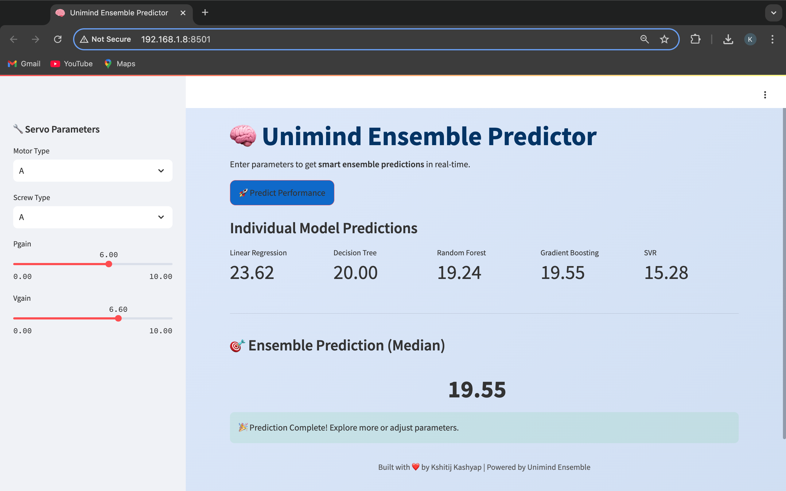

# 🧠 Unimind Ensemble Predictor

Unimind is an interactive Streamlit application that delivers **smart ensemble predictions** by aggregating outputs from multiple machine learning models.

---

## 📌 Objective
Combine diverse regressors—**Ridge (polynomial)**, **Decision Tree**, **Random Forest**, **Gradient Boosting**, and **SVR**—to produce robust numerical predictions for any new data point through a median ensemble strategy.

---

## 🧰 Tools & Libraries
- 🐍 **Python 3.x**  
- 📊 **Pandas**, **NumPy** – data handling  
- 📈 **Scikit-learn** – model pipelines and hyperparameter searches  
- 🚀 **Streamlit** – elegant web interface  
- 💾 **Joblib** – serialization of pipelines  

---

## 📁 Repository Structure
```
Unimind-Ensemble-Predictor/
├── Decision Tree/
│   ├── Decision_Tree.ipynb
│   └── decision_tree_model.pkl
├── EDA/
│   └── EDA.ipynb
├── Ensemble/
│   ├── Ensemble.ipynb
│   └── ensemble_predictions.csv
├── Gradient Boosting/
│   ├── Gradient_Boosting.ipynb
│   └── gradient_boosting_model.pkl
├── Linear Regression/
│   ├── Linear_Regression.ipynb
│   └── linear_regression_model.pkl
├── Random Forest/
│   ├── Random_Forest.ipynb
│   └── random_forest_model.pkl
├── Svr/
│   ├── Svr.ipynb
│   └── svr_model.pkl
├── Output_SS.png
├── README.md
├── Servo_Mechanism.csv
├── app.py
└── requirements.txt
```

---

## 🚀 Getting Started

1. **Clone the repo**  
   ```bash
   git clone https://github.com/kshitij7704/Unimind_Ensemble_Predictor.git
   cd Unimind_Ensemble_Predictor
   ```

2. **Create & activate a virtual environment**  
   ```bash
   python -m venv venv
   source venv/bin/activate  # macOS/Linux
   venv\Scripts\activate   # Windows
   ```

3. **Install dependencies**  
   ```bash
   pip install -r requirements.txt
   ```

4. **Run the app**  
   ```bash
   streamlit run streamlit_app.py
   ```

---

## 🔍 Project Workflow

1. **EDA:** Understand data distributions and correlations.  
2. **Preprocessing:** Encode categories, scale numerics, add polynomial features.  
3. **Model Training:** Train & tune multiple regressors via cross-validation.  
4. **Ensemble:** Serialize pipelines & combine via median for stability.  
5. **Deployment:** Streamlit UI for instant predictions.

---

---

## 🎨 UI Preview


*The app features a clean sidebar for inputs and a modern layout for your predicted Class.*

---

## 📈 Performance Metrics

| Model                  | MSE    | R²    |
|------------------------|--------|-------|
| Ridge + Polynomial     | 38.925 |  0.834|
| SVR (RBF)              | 40.674 |  0.827|
| Decision Tree          | 69.324 |  0.704|
| Random Forest          | 28.008 |  0.881|
| Gradient Boosting      | 37.819 |  0.839|
| **Ensemble**           | 53.303 |  0.773|


---

## 🤝 Contributing
Contributions welcome! Open issues or PRs to improve Unimind.

---

## 📝 Author
Made by [**Kshitij Kashyap**](https://kshitij-kashyap-portfolio.netlify.app/)
